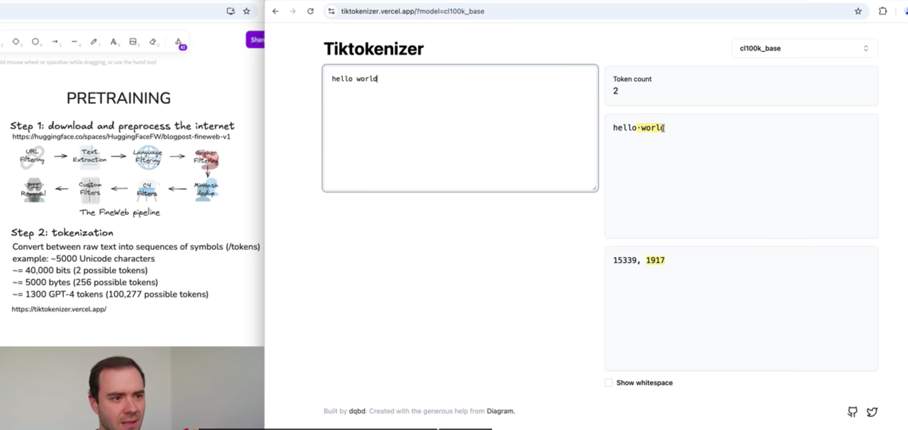
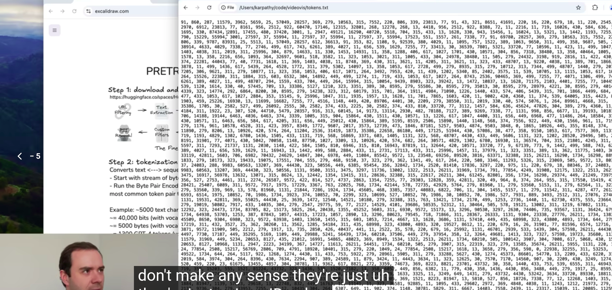
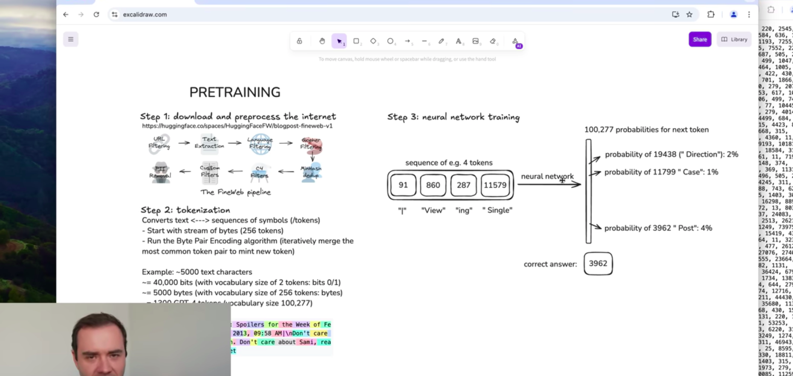
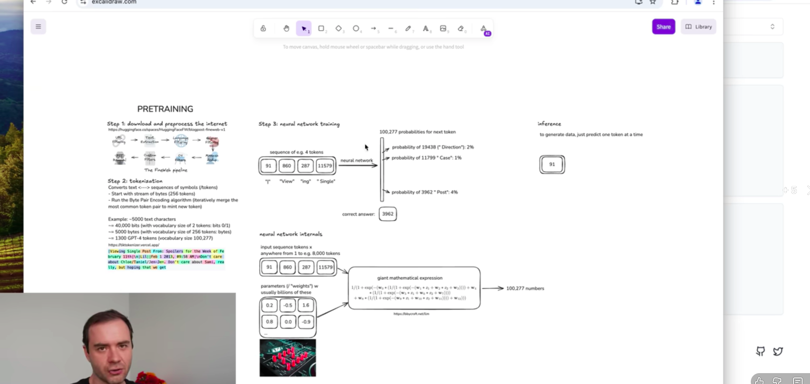
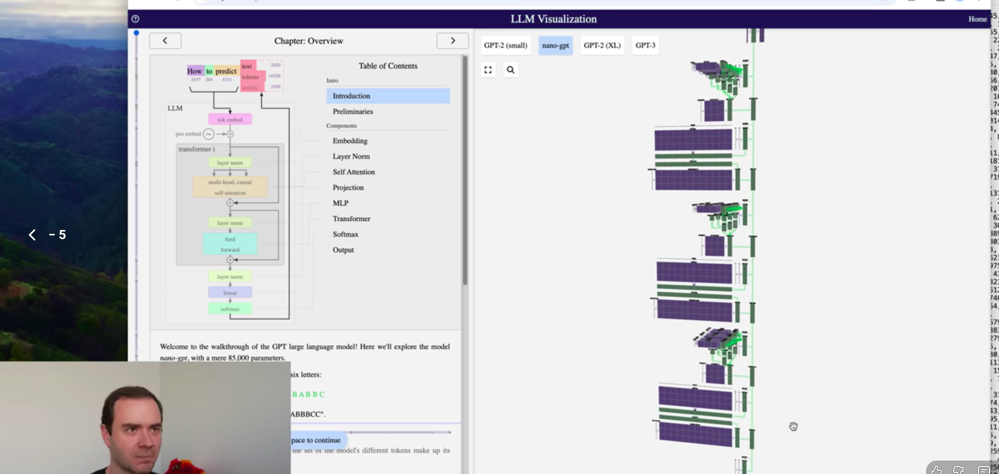
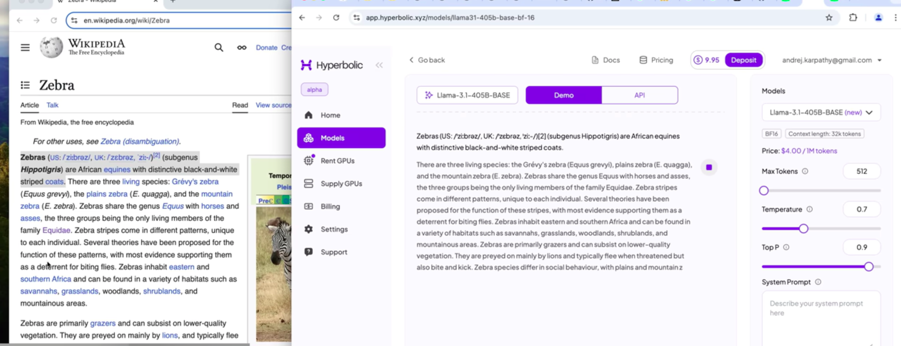
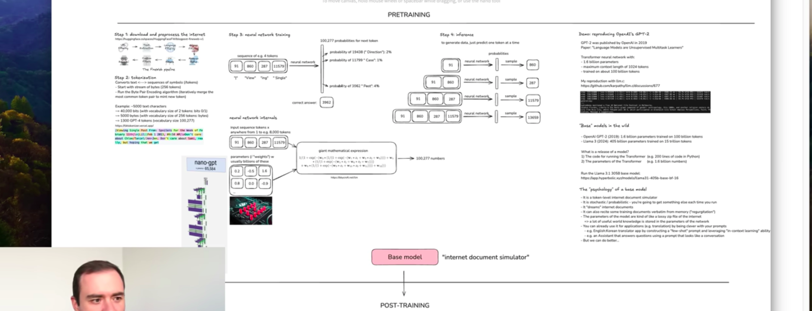

# Deep Dive into LLMS

## Step 1: Pretraining

[https://huggingface.co/spaces/HuggingFaceFW/blogpost-fineweb-v1]()

Fineweb is a dataset available on hugging face with 15 trillion tokens and roughly 44TB disk space

**Processing**

- the text is not understandable by computers, we need to convert to numbers that computers can understand
- Using let's say utf-8 will convert it to binary and although good for computer, it will be massive and not optimized
- so we use byte conversion where we represent them between 0 to 256
- the we use algorithms to figure out repeating patterns and compress it

### 1. Tokenization

The process of converting raw text to sequence of symbols (tokens) is called **tokenization**

### 2. Neural network training

- from the tokens we predefine the number of tokens to be taken
- then let's say we take the firs t4 tokens - they now act as a context and are feed to neural net
- initially neural net is randomly initialized which means the initial probability will of all the next tokens is random
- but we have the correct answer (this is still training step) - so we can train it to model it correctly

Here are the detailed notes on the training and internals from the video, followed by the new section on  **Inference** .

### **3. Neural Network Training**

* **The Objective:** The goal is to model the statistical relationships of how tokens follow one another. We want the network to internalize the "texture" of the internet.
* **The Process:**
  * **Input:** We take a "context window" of tokens from the dataset (e.g., 4 tokens like `The`, `cat`, `sat`, `on`).
  * **Target:** The network tries to predict the *next* token (e.g., `the`).
  * **Initialization:** The network starts with random parameters (weights), so its initial guesses are complete garbage.
  * **The Update Loop:**
    1. **Forward Pass:** The model calculates a probability distribution for what comes next.
    2. **Loss Calculation:** We compare the model's guess to the *actual* next token in the data. "Low loss" means the guess was good.
    3. **Optimization:** We mathematically calculate how to "nudge" the parameters so the correct token has a slightly higher probability next time.
  * **Scale:** This happens in parallel on massive batches of tokens (e.g., 1 million tokens per update) across thousands of GPUs (like NVIDIA H100s).

### **4. Neural Network Internals**

* **The Architecture:** Modern LLMs use the **Transformer** architecture.
  * **Parameters:** These are the "knobs" of the system. GPT-2 had 1.6 billion; Llama 3 has 405 billion. Think of these parameters as a **lossy compression** of the internet.
* **Data Flow:**
  * **Embeddings:** Tokens are converted into vectors (lists of numbers).
  * **Transformer Block:** The vectors flow through layers of "Attention" (tokens talking to each other) and "MLPs" (tokens thinking individually).
  * **Statelessness:** The model has no persistent memory or "self." It boots up, processes the context window, generates a token, and shuts down. It is a mathematical function, not a living entity. (not like our brain)
* **The "Swiss Cheese" Model:** Because there is a finite amount of compute (fixed number of layers) for every token, the model cannot "think hard" on a single token. This leads to "holes" in capability—it might solve a PhD-level physics problem but fail to count the number of 'r's in "Strawberry" or tell you that 9.11 is larger than 9.9.
* 

this is a transformer on bbycroft.net

---

### **5. Inference (Generation)**

Inference is the stage where we stop training (fix the weights) and actually *use* the model to generate text.

* **The Mechanism: Auto-Regression**

  1. **Prefix:** You provide a prompt (e.g., "The sky is").
  2. **Probability Distribution:** The model outputs a probability for every possible next token (e.g., "blue": 85%, "gray": 10%, "falling": 1%).
  3. **Sampling (The "Biased Coin"):** We do not just pick the top answer. We "flip a biased coin" based on these percentages. This introduces **randomness** (stochasticity - having a random probability distribution or pattern that may be [analysed](https://www.google.com/search?sca_esv=aaedd9f10623a379&sxsrf=ANbL-n48q4ME3OOR2C-Sj8NjvmIG6JGkbg:1771861047888&q=analysed&si=AL3DRZGqprsEvjmyWiMbyiIKX3gMYzh6HYR99n2D3jJFuV6KmyvDxaVIDdj7FYgb8k0n6SPdtyT9B6_oCCVTJo8_a4HTlReF30UYUb5C8jjvOWm3d4Pv2vU%3D&expnd=1&sa=X&ved=2ahUKEwim6Obi-O-SAxWU1jgGHRIZCaAQyecJegQIHhAd) statistically but may not be predicted precisely.).
  4. **Loop:** The chosen token ("blue") is appended to your prompt. The new input is "The sky is blue", and the process repeats to generate the next word.
* **Hallucination (Dreaming)**

  * Since the model is just a "Token Tumbler" predicting the next likely word, it does not know facts. It has a "vague recollection" of the internet.
  * If you ask about a fake person (e.g., "Who is Orson Kovats?"), the model might hallucinate a biography because it follows the *statistical pattern* of a biography, even if the facts are made up.
* **Context Window vs. Parameters**

  * **Parameters:** Long-term memory (vague recollection, hard to change).
  * **Context Window:** Short-term working memory (perfect recall, limited size).
  * *Tip:* If you want the model to summarize a book chapter, don't ask it to recall it from parameters. Paste the text into the Context Window (working memory) for a perfect result.

### **GPT-2 (The "Grandparent" Architecture)**

Karpathy uses GPT-2 (released by OpenAI in 2019) as the example because it is the first time the "modern stack" came together. Every LLM today (GPT-4, Llama 3) is essentially just a scaled-up version of this architecture.

#### **1. The Specs (Model Definition)**

* **Parameters:** ~1.6 Billion. (Think of this as the size of the compressed file).
* **Context Window:** 1,024 tokens. (Very small by modern standards. It can only "see" about 3-4 paragraphs back).
* **Training Data:** ~100 Billion tokens (WebText dataset).
* **Cost to Train:**
  * **2019:** ~$40,000.
  * **2024:** ~$600 (using modern H100s and optimized C code like `llm.c`).

#### **2. The Training Loop (The "Oven")**

This is the process of compressing the internet into those 1.6B parameters.

* **The Batch Size:**  **1 Million tokens** .
  * *Crucial Distinction:* The model does not read one document at a time. It grabs random chunks from the dataset (each 1,024 tokens long) until it has a pile of ~1,000 chunks. It processes this massive pile **in parallel** in a single forward pass.
* **The Iterations:** 32,000 Steps.
  * **Step Duration:** ~7 seconds per step (on 8x H100 GPUs).
  * **Total Throughput:** 32,000 steps $\times$ 1M tokens = ~33 Billion tokens seen during this specific run.
* **The "Loss" Function:**
  * This is the only number the engineer watches. It measures the error rate between the model's prediction and the actual next word.
  * **Goal:** Drive Loss to zero (though it never actually hits zero, just a low floor).

#### **3. Inference (The "Sanity Check")**

Every 20 steps, the training pauses to run **Inference** to see what the model has learned.

* **Step 0 (Start):** The weights are random. The output is complete gibberish (random characters/symbols).
* **Step ~100:** The model learns "syntax" first (e.g., words usually have spaces between them, periods go at the end of sentences). It looks like English structure but means nothing.
* **Step 32,000 (End):** The model has "internalized" the statistics of the data. It generates coherent English.
* **The "Dream":** The output is a **stochastic (random)** walk. You feed it a prompt, it calculates probabilities, and you "flip a biased coin" to pick the next token. It is effectively "dreaming" valid-looking internet text.

#### **4. The Hardware (The Compute)**

* **The Unit:** NVIDIA H100 GPU.
* **The Cluster:** A "Node" usually contains 8 of these GPUs strapped together.
* **Why GPUs?** Neural net training is just massive matrix multiplication. GPUs are embarrassingly parallel, making them perfect for processing that 1M token batch simultaneously.

---

Training is essentially a massive optimization problem:
`Input (1M tokens) -> Forward Pass -> Calculate Error (Loss) -> Backprop (Update Weights) -> Repeat 32,000 times.`

We have now covered the **Base Model** (Pre-training). This model is just a "Token Simulator"—it completes text but won't answer questions helpfully.

Parameters are a **universal concept** in all neural networks, not specific to LLMs.

In any neural network (from a simple image classifier to GPT-4), parameters are simply the internal **weights** (floating-point numbers) that define how the network processes input.

* **The Math:** At a low level, a neural network is just a massive mathematical expression. The parameters are the coefficients in that expression (the numbers in the matrices that multiply your input data).
* **The Difference is Scale:**
  * **Traditional NNs:** Might have thousands or millions of parameters.
  * **LLMs:** Have massive scale. GPT-2 had 1.6 billion; Llama 3 has 405 billion.
* **Function:** In LLMs, these billions of parameters collectively act as the storage medium for the "lossy compression" of the internet.

In short: Parameters are the "knobs" on the machine. An LLM just happens to be a machine with 405 billion knobs.

---

this is what base model do

Here are your notes on  **Base Model Inference** , specifically regarding the **Llama 3.1 405B** demo from the video.

### **Base Model (Llama 3.1 405B)**

* **Definition:** This is a "Token Simulator" or "Internet Document Simulator."
* **Status:** It is **NOT** an assistant yet. It has no desire to help you; it only wants to complete the string you give it.

#### **1. The "Autocomplete" Behavior**

* **The Fail:** If you prompt it with  *"What is 2+2?"* , it will not answer "4".
* **The Result:** It creates more questions (e.g.,  *"What is 4+4?"* ) or goes on a philosophical rant. It assumes the input is a list of questions found on a website and simply generates the rest of the list.
* **Stochasticity:** The output is probabilistic. If you run the same prompt twice, you get different "parallel universes" of text generation because of the random sampling (Temperature).

#### **2. Knowledge Storage (The "Lossy Zip File")**

* **Retrieval:** The model "remembers" facts stored in its parameters (weights), but this memory is vague and probabilistic.
* **Regurgitation (Memorization):** If a text appears frequently in the training data (like the Wikipedia intro for "Zebra"), the model can recite it verbatim. This is because it has "overfit" on that specific sequence.
* **Hallucination (Dreaming):**
  * *Scenario:* Asked about the 2024 US Election (which happened *after* the model's data cutoff).
  * *Result:* It didn't say "I don't know." It hallucinated a VP pick (e.g., Mike Pence or DeSantis) because it followed the *statistical pattern* of a news article, even though the facts were made up.

#### **3. Hacking the Base Model (Prompt Engineering)**

Since the model is just a pattern matcher, you can "trick" it into being useful without changing its weights.

* **In-Context Learning (Few-Shot Prompting):**
  * *Goal:* Translate English to Korean.
  * *Method:* You don't ask "Translate this." Instead, you paste 10 examples of `English: Korean` pairs into the Context Window.
  * *Result:* The model recognizes the pattern and completes the 11th pair correctly. It "learned" the task just by looking at the Context Window.
* **Simulating an Assistant:**
  * *Method:* You write a prompt that *looks* like a transcript:
    `"The following is a conversation between a helpful assistant and a user. User: Why is the sky blue? Assistant:"`
  * *Result:* To complete the pattern, the Base Model *roleplays* as an assistant and answers the question.

---

**Summary:** The Base Model is raw potential. It contains the world's knowledge but requires clever prompting to extract it.

**Next Topic:**
To fix this "usability" problem, we enter the **Post-Training Stage** (Supervised Fine-Tuning), where we turn this document simulator into a dedicated Chatbot.

Here are your notes on  **Post-Training (Supervised Fine-Tuning)** . This is the stage where we turn the "Internet Simulator" into an actual product like ChatGPT.

## Post Training

### **The Phase: Supervised Fine-Tuning (SFT)**

* **The Goal:** We don't want a model that autocompletes internet documents; we want a model that answers questions.
* **The Shift:** We switch the dataset.
  * **Pre-training:** Trained on 15 Trillion tokens of raw internet text (Web Pages).
  * **Post-training:** Trained on a curated dataset of **Conversations** (e.g., 100,000 to 1 Million examples).
* **Efficiency:** This stage is computationally cheap. While pre-training takes months, SFT might take only **~3 hours** because the dataset is tiny by comparison.

### **1. The Data: Conversations**

* **Structure:** We no longer feed raw text. We feed structured dialogue:
  > **User:** What is 2+2?
  > **Assistant:** The answer is 4.
  > **User:** What if you multiply?
  > **Assistant:** Then it is 4 as well.
  >
* **Tokenization Protocol:**
  * The model still only sees a 1-dimensional stream of tokens.
  * To represent "turns," we introduce **Special Tokens** that were not in the pre-training set.
  * *Example (GPT-4 style):* `<|im_start|>user` ... `<|im_end|><|im_start|>assistant` ....
  * The model learns that when it sees `<|im_start|>assistant`, it is its turn to speak.

### **2. The Human Labelers (The "Soul" of the Model)**

* **Who are they?** Companies hire armies of human contractors (often experts or PhDs for specialized topics like coding).
* **The Task:** They are given a prompt (e.g., "Write a Python script to scrape a website") and they must write the  **Ideal Assistant Response** .
* **Labeling Instructions:**
  * These humans follow massive documentation (hundreds of pages) defining exactly how to behave.
  * *Core Principles:* Be Helpful, Truthful, and Harmless.
  * *Tone:* Don't be preachy, be concise, admit when you don't know (refusals).
* **Modern Shift:** Nowadays, humans don't always write from scratch. They often use an advanced LLM to generate a draft, then edit/refine it. This is "AI-assisted labeling".

### **3. The Mental Model: "Simulation of a Human Labeler"**

This is the most critical psychological insight for an engineer:

* **You are not talking to a digital brain.**
* **You are talking to a Simulation.** When you prompt ChatGPT, the model is asking itself:
  > *"Based on the statistical patterns I learned during SFT, how would one of those OpenAI human labelers answer this question?"*
  >
* **Implication:** If you ask a question that wasn't in the SFT data, the model acts as an  **improv actor** , roleplaying what that human *would* likely write.

---

**Summary:** SFT is "Programming by Example." We give the model 100,000 examples of how to be a good assistant, and it learns to copy that style.

**Next Logical Step:**
The SFT model is helpful, but it has a major flaw:  **Hallucinations** . It tries to simulate a helpful human so hard that it will confidently lie to you if it doesn't know the answer.

Here are your notes on  **Hallucinations & Tool Use** , detailing why models lie and how we engineer them to stop.

### **The Problem: Hallucination**

* **Definition:** The model confidently creates false information.
* **The Cause:**
  * The model is a  **Statistical Mimic** , not a truth database.
  * During SFT (Supervised Fine-Tuning), it learned that helpful assistants answer questions confidently.
  * **Scenario:** If you ask about a fake person (e.g.,  *"Who is Orson Kovats?"* ), the model's internal "uncertainty neurons" might fire, but it hasn't been trained to say "I don't know." Instead, it mimics the **shape** of a biography (e.g.,  *"He was a minor league baseball player..."* ) because that is statistically the most likely text completion for a "Who is..." question.

### **Mitigation 1: Teaching "I Don't Know"**

* **The Fix:** We must explicitly train the model to refuse questions it doesn't know.
* **The Method (Knowledge Probing):**
  1. Developers take a fact (e.g., "Who won the 1999 Stanley Cup?").
  2. They ask the model 5 times.
  3. If the model gives 5 different answers (inconsistent), we know it is guessing.
  4. We create a training example where the correct response is *"I am sorry, I don't know that information"* and feed it back into the model.

### **Mitigation 2: Tool Use (Web Search)**

This is the biggest shift in modern architectures. We stop relying on the model's parameters for facts.

* **The Memory Architecture:**
  * **Parameters (Weights):** Vague, long-term recollection (like a book you read a month ago).
  * **Context Window:** Perfect working memory (like a book open in front of you).
* **The Mechanism:**
  Instead of hallucinating a fact, we teach the model to use a  **Search Engine** .
  1. **Trigger:** The model encounters a question it is unsure about.
  2. **Action:** Instead of generating text, it emits a special token: `<search_start> "Current US President" <search_end>`.
  3. **Pause:** The system pauses the model, runs the Google/Bing search, and copies the text results.
  4. **Inject:** The system pastes the search results into the model's  **Context Window** .
  5. **Resume:** The model reads the fresh text and answers the question accurately.

### **Mitigation 3: Tool Use (Code Execution)**

* **The Weakness:** LLMs are bad at math and counting (e.g., counting 'r's in "Strawberry" or calculating `134 * 491`). They try to predict the answer in a single token, which fails for complex logic.
* **The Fix:** We teach the model to write Python code instead of doing mental math.
  * *Prompt:* "Count the 'r's in Strawberry."
  * *Model Action:* Writes `print("Strawberry".count("r"))`.
  * *System Action:* Runs the code, gets `3`, and pastes it back.
  * *Result:* The model reports the correct answer.

---

**Summary:** We are moving away from treating the LLM as a "Know-It-All" Oracle. We now treat it as a **Reasoning Engine** that uses tools (Search, Python) to fetch and process data.

**Next Logical Step:**
The final frontier of training is  **Reinforcement Learning (RL)** . This is how models like **DeepSeek R1** and **OpenAI o1** learn to "think" for 30 seconds before answering.

Here are your notes on the psychological and mechanical quirks of LLMs.

### **1. Knowledge of Self (Identity)**

* **The Reality:** The model has no persistent "Self." It is a stateless function that boots up, processes tokens, and shuts down. It does not remember you from yesterday.
* **The "Who are you?" Hallucination:**
  * If you ask a random open-source model "Who are you?", it will often say *"I am ChatGPT, trained by OpenAI."*
  * **Why?** Because the internet contains millions of conversations where an AI says "I am ChatGPT." The model mimics this statistical pattern because it has no true self-knowledge.
* **The Fix:** Developers must "hardcode" identity via:
  1. **System Prompts:** Hidden instructions at the start of the context window (`You are Llama, trained by Meta`).
  2. **SFT Data:** Fine-tuning on Q&A pairs like `User: Who are you? Assistant: I am Llama.`

### **2. Models Need Tokens to Think**

* **The Constraint:** There is a fixed amount of compute (finite layers) per token. The model cannot perform infinite mental math in a single forward pass.
* **The "Emily buys apples" Example:**
  * **Bad Prompt:** "Answer immediately." $\rightarrow$ The model must calculate `(3*2) + (2*2)...` and output the final number in  *one token* . It often fails.
  * **Good Prompt:** "Show your work." $\rightarrow$ The model generates intermediate text (`3 apples at $2 is $6...`).
* **Engineering Takeaway:** **Distribute Compute.**
  * Think of the Context Window as a "scratchpad."
  * By forcing the model to write out steps, you are letting it "offload" computation to the Context Window, turning a hard mental math problem into a simpler next-token prediction task.

### **3. Tokenization Revisited (Why it can't spell)**

* **The Blind Spot:** Models do not see characters (A, B, C). They see integers (Tokens).
* **The "Strawberry" Problem:**
  * User: "How many r's in Strawberry?"
  * Model Input: `[TokenID: 5932]` (representing "Strawberry").
  * Model Processing: It tries to recall a statistical fact about that integer. It does not "scan" the string because the string doesn't exist in its world.
* **The "Ubiquitous" Problem:**
  * User: "Print every 3rd letter of 'ubiquitous'."
  * Model: Fails, because "ubiquitous" is likely 1 or 2 tokens. It cannot index into the characters unless it uses a tool (Python) to break the string apart.

### **4. Jagged Intelligence (The "Swiss Cheese" Model)**

* **The Paradox:** Models are not uniformly smart. They are "Jagged."
  * They can solve International Math Olympiad problems (PhD level).
  * They can fail to tell you that **9.11 is smaller than 9.9** (Kindergarten level).
* **The 9.11 vs 9.9 Bug:**
  * Many models claim 9.11 is bigger.
  * *Karpathy's Theory:* In the training data, "9.11" often appears as a **Bible Verse** or software version, where it comes *after* 9.9. The model associates the pattern of "9.11" with "being later/higher" than "9.9".
* **Takeaway:** Do not treat the model as a "Smart Human." Treat it as a stochastic tool that has random "holes" in its intelligence capabilities. Always verify.

---

**Next Topic:**
The final frontier in the video is  **Reinforcement Learning (RL)** —the technique used by models like **DeepSeek R1** to "think" before they speak.

Here are your notes on  **Reinforcement Learning (RL)** , the third and final stage of training. This is currently the "frontier" of AI development (e.g., DeepSeek R1, OpenAI o1).

### **The Analogy: "Going to School"**

Karpathy compares the three stages of training to a student learning from a textbook:

1. **Pre-training (Base Model):** Reading the chapters (Exposition). You gain a broad, vague understanding of knowledge.
2. **SFT (Assistant):** Reading the "Worked Solutions" at the end of the chapter. You learn how experts solve problems by imitating them.
3. **Reinforcement Learning (RL):** Doing the  **Practice Problems** . You are given a problem, but *not* the solution. You must try, fail, and figure out the best path yourself.

---

### **1. The Mechanics of RL (Guess & Check)**

* **The Problem:** In SFT (imitation), we force the model to solve a problem exactly how a human would. But humans might not use the most efficient "mental path" for an AI.
* **The Process:**
  1. Give the model a prompt (e.g., a math problem).
  2. Let it generate **1,000 different solutions** randomly.
  3. **Check the Answer:** If the final answer is correct (Verifiable Domain), we mark that solution as "Good."
  4. **Train:** We teach the model to effectively "do more of what worked" and "less of what failed".
* **The Result:** The model *discovers* its own way of thinking. It might find strategies that humans never taught it.

### **2. DeepSeek R1 & "Thinking" Models**

* **Emergent Behavior:** When you run RL on math/code problems for long enough, the model learns to **"Think"** (Chain of Thought).
  * It starts talking to itself: *"Wait, let me double check that... No, that approach is wrong, let me try again."*
  * *Crucial Note:* No human hard-coded this "self-correction." The model learned that *spending more tokens to double-check its work* statistically leads to higher accuracy.
* **Accuracy vs. Cost:** These models are much slower and "bloat" the token count, but they solve hard problems (Olympiad Math) that standard assistants fail at.

### **3. AlphaGo & "Move 37" (Superhuman Ability)**

* **The Limit of SFT:** If you only train an AI to imitate humans (SFT), it can never become smarter than a human. It caps at "Human Expert" level.
* **The Promise of RL:** Because the model learns from *results* (winning the game) rather than  *mimicry* , it can discover strategies humans missed.
  * *Example:* **Move 37** in AlphaGo. The AI played a move that looked like a mistake to all human experts, but it turned out to be a brilliant, winning strategy.
  * **Goal:** We want LLMs to find the "Move 37" of physics, coding, or medicine—solutions no human would have thought to write down in the training data.

### **4. RLHF (The "Fake" RL)**

There is a distinction between "Real RL" (Math/Code) and "RLHF" (Chatting/Jokes).

* **Verifiable Domains (Math/Code):** We know if the answer is correct (True/False). We can run RL indefinitely to get super-intelligence.
* **Unverifiable Domains (Writing Jokes/Poetry):** There is no "correct" answer.
  * *Method:* We train a "Reward Model" (a separate neural net) to act as a judge and give a score.
  * *The Flaw:* If you train too long against a Reward Model, the LLM learns to **"game the system."** It finds nonsense text (e.g., "The the the") that tricks the judge into giving a high score.
  * *Takeaway:* RLHF is useful for tone/safety, but it is not the engine for super-intelligence because the grading system is gameable.

---

**Summary of the Series:**

1. **Pre-training:** Download the internet $\rightarrow$ Token Simulator.
2. **SFT:** Curate conversations $\rightarrow$ Helpful Assistant.
3. **RL:** Practice hard problems $\rightarrow$ Reasoning Engine.

**This concludes the core technical breakdown.**

Here is a comprehensive summary structured to fit perfectly at the end of your Markdown notes. It ties all the concepts together using Karpathy's "Student Analogy."

---

## **Executive Summary: The Mental Model of an LLM**

The creation of a Large Language Model is best understood through the analogy of a student going through the education system. It happens in three distinct stages, transforming a raw "internet simulator" into a reasoning engine.

### **Stage 1: Pre-training (The Student Reading Textbooks)**

* **Goal:** Knowledge Acquisition.
* **The Process:** The model reads a massive chunk of the internet (e.g., 15 Trillion tokens from FineWeb),.
* **The Mechanism:** It plays "Next Token Prediction". By trying to guess the next word in billions of documents, it forces its parameters to internalize the syntax, facts, and "texture" of the world.
* **The Result:** A **Base Model** (e.g., Llama 3 Base).
  * *Capability:* It is a "Token Simulator." It completes documents but does not answer questions.
  * *Nature:* It is a **lossy compression** of the internet.

### **Stage 2: Supervised Fine-Tuning (The Student Reading Worked Solutions)**

* **Goal:** Format & Persona Alignment.
* **The Process:** We discard the internet data and switch to a curated dataset of  **Conversations** .
* **The Mechanism:** **Imitation Learning.** Human labelers write ideal Q&A pairs (Prompts + Responses). The model learns to mimic the style, tone, and helpfulness of these experts.
* **The Result:** An **SFT Model** (e.g., GPT-4).
  * *Capability:* It acts as a helpful assistant.
  * *Mental Model:* You are not talking to a digital brain; you are talking to a  **stochastic simulation of a human data labeler** .

### **Stage 3: Reinforcement Learning (The Student Doing Practice Problems)**

* **Goal:** Reasoning & Accuracy.
* **The Process:** The model is given problems *without* the solution.
* **The Mechanism:** **Trial and Error (Guess & Check).**
  * The model generates thousands of attempts.
  * Correct answers are rewarded; incorrect ones are penalized.
  * The model "discovers" thinking strategies (like self-correction and backtracking) that humans may never have explicitly taught it.
* **The Result:** A **Reasoning Model** (e.g., DeepSeek R1).
  * *Capability:* It can "think" (process chains of thought) before answering, allowing it to solve verifiable problems (Math/Code) at a superhuman level.

---

### **Key Psychological Concepts (The "Gotchas")**

1. **Parameters vs. Context Window**
   * **Parameters (Weights):** Long-term, vague recollection. Like remembering a book you read years ago. susceptible to hallucinations.
   * **Context Window:** Short-term, perfect working memory. Like having the book open in front of you.
   * *Tip:* Always paste data into the Context Window rather than relying on the model's memory.
2. **The "Swiss Cheese" Intelligence**
   * Models are  **Jagged** . They can solve PhD-level physics problems but fail to count the number of 'r's in "Strawberry" or compare 9.11 vs. 9.9,.
   * *Reason:* They have finite compute per token. If a task requires more "mental steps" than a single token generation allows, the model will fail unless instructed to "show its work" or use tools.
3. **Tool Use over Mental Math**
   * LLMs are bad at calculation and counting because they see  **Tokens** , not characters or numbers.
   * *Solution:* Never ask an LLM to do math in its head. Ask it to write **Python Code** to calculate the answer.
