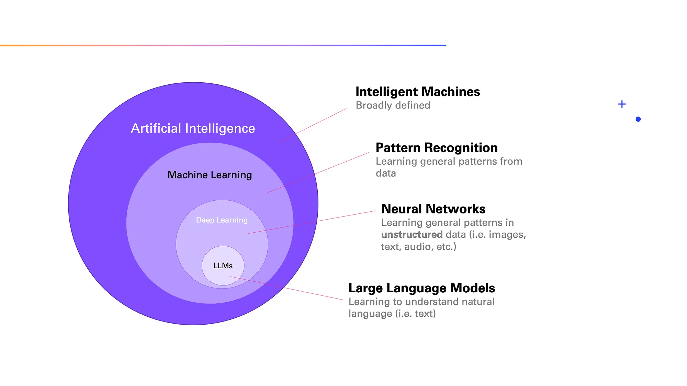

The field of AI is often visualized in layers:

* **Artificial Intelligence** (AI) is very a broad term, but generally it deals with intelligent machines.
* **Machine Learning** (ML) is a subfield of AI that specifically focuses on pattern recognition in data. As you can imagine, once you recoginze a pattern, you can apply that pattern to new observations. That’s the essence of the idea, but we will get to that in just a bit.
* **Deep Learning** is the field within ML that is focused on unstructured data, which includes text and images. It relies on artificial neural networks, a method that is (loosely) inspired by the human brain.
* **Large Language Models** (LLMs) deal with text specifically, and that will be the focus of this article.

# Machine Learning

The goal of Machine Learning is to discover patterns in data. Or more specifically, a pattern that describes the relationship between an input and an outcome. This is best explained using an example.

Let’s say we would like to distinguish between two of my favorite genres of music: reggaeton and R&B. If you are not familiar with those genres, here’s a very quick intro that will help us understand the task. Reggaeton is a Latin urban genre known for its lively beats and danceable rhythms, while R&B (Rhythm and Blues) is a genre rooted in African-American musical traditions, characterized by soulful vocals and a mix of upbeat and slower-paced songs.

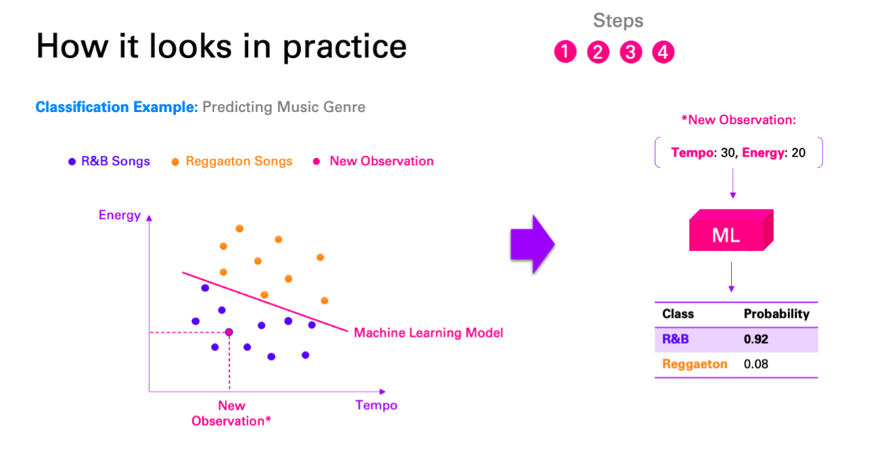

In Machine Learning terms, we say that this is a classification problem, because the outcome variable (the genre) can only take on one of a fixed set of classes/labels — here reggaeton and R&B. This is in contrast to a regression problem, where the outcome is a continuous value (e.g., a temperature or a distance).

We can now “train” a Machine Learning model (or “classifier”) using our labeled dataset, i.e., using a set of songs for which we do know the genre. Visually speaking, what the training of the model does here is that it finds the line that best separates the two classes.

The more complex the relationship between input and output, the more complex and powerful is the Machine Learning model we need in order to learn that relationship. Usually, the complexity increases with the number of inputs and the number of classes.

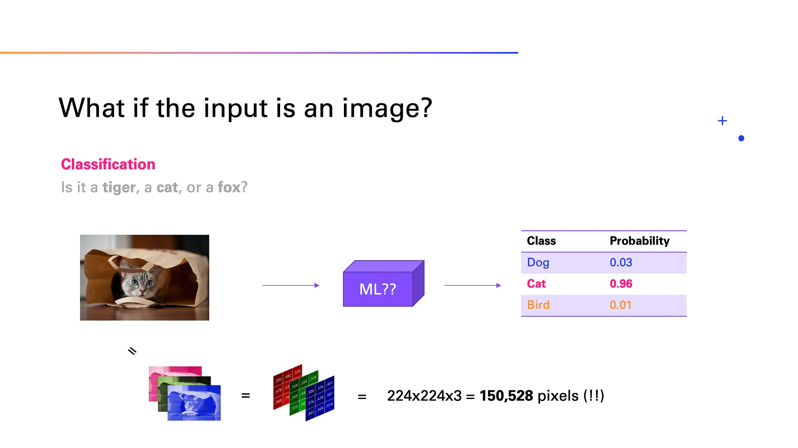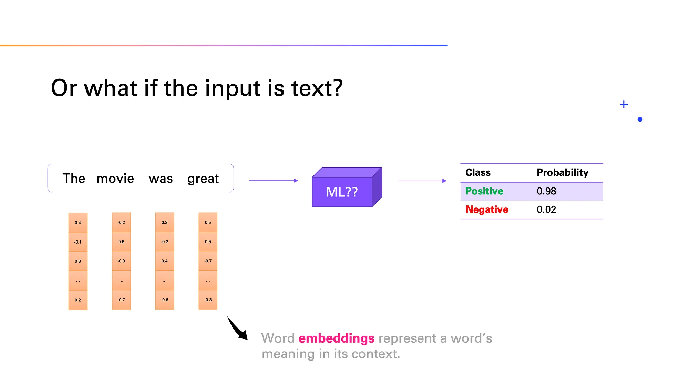

As the input here we have a sequence of words, i.e., a sentence, and the sentiment is our outcome variable. As before, this is a classification task, this time with two possible labels, i.e., positive or negative.

we can take a sentence and turn it into a sequence of numeric inputs, i.e., the word embeddings, which contain semantic and syntactic meaning. This can then be fed into a Machine Learning model.

### Challenges

Great, but now we face the same challenges as with the visual input. As you can imagine, with a long sentence (or paragraph or even a whole document), we can quickly reach a very large number of inputs because of the large size of the word embeddings.

The second problem is the relationship between language and its sentiment, which is complex — very complex. Just think of a sentence like “That was a great fall” and all the ways it can be interpreted (not to mention sarcastically).

What we need is an extremely powerful Machine Learning model, and lots of data. That’s where Deep Learning comes in.

# Deep Learning

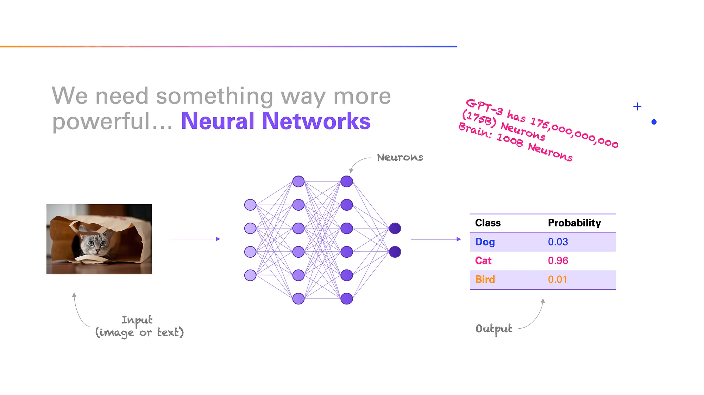

neural networks are loosely inspired by the brain, although the actual similarities are debatable. Their basic architecture is relatively simple. They consist of a sequence of layers of connected “neurons” that an input signal passes through in order to predict the outcome variable. You can think of them as multiple layers of linear regression stacked together, with the addition of non-linearities in between, which allows the neural network to model highly non-linear relationships.

# Large Language Model

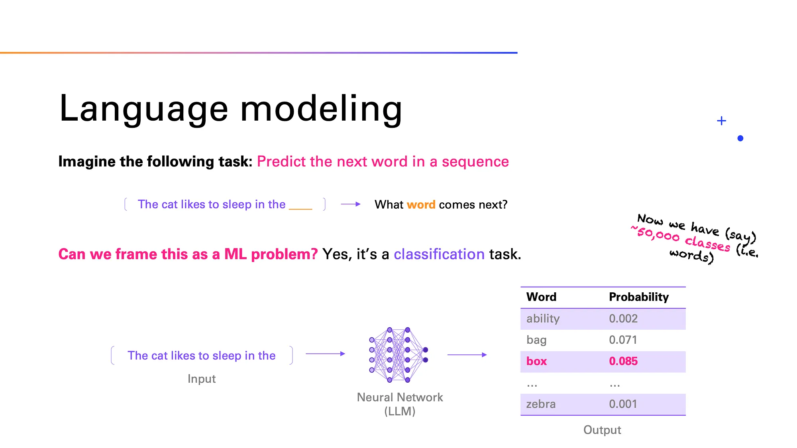

As in that example, the input to the neural network is a sequence of words, but now, the outcome is simply the next word. Again, this is just a classification task. The only difference is that instead of only two or a few classes, we now have as many classes as there are words — let’s say around 50,000. This is what language modeling is about — learning to predict the next word.

Okay, so that’s orders of magnitude more complex than the binary sentiment classification, as you can imagine. But now that we also know about neural networks and their sheer power, the only response to that concern is really “why not?”

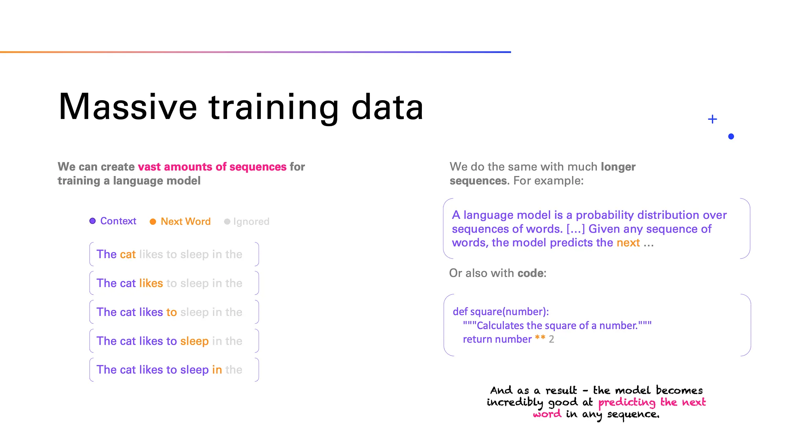

We know the task, and now we need data to train the neural network. It’s actually not difficult to create a lot of data for our “next word prediction” task. There’s an abundance of text on the internet, in books, in research papers, and more. And we can easily create a massive dataset from all of this. We don’t even need to label the data, because the next word itself is the label, that’s why this is also called  *self-supervised learning* .

Just a single sequence can be turned into multiple sequences for training. And we have lots of such sequences. Importantly, we do this for many short and long sequences (some up to thousands of words) so that in every context we learn what the next word should be.

To summarize, all we are doing here is to train a neural network (the LLM) to predict the next word in a given sequence of words, no matter if that sequence is long or short, in German or in English or in any other language, whether it’s a tweet or a mathematical formula, a poem or a snippet of code. All of those are sequences that we will find in the training data.

If we have a large enough neural network as well as enough data, the LLM becomes really good at predicting the next word. Will it be perfect? No, of course not, since there are often multiple words that can follow a sequence. But it will become good at selecting one of the appropriate words that are syntactically and semantically appropriate.

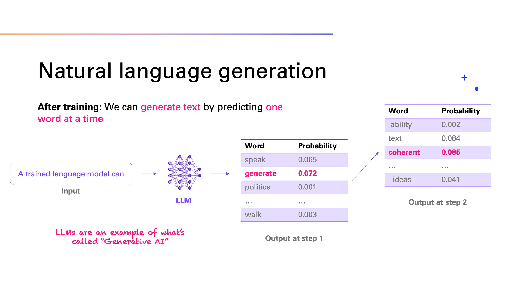

There’s one more detail to this that I think is important to understand. We don’t necessarily always have to predict the most likely word. We can instead sample from, say, the five most likely words at a given time. As a result, we may get some more creativity from the LLM. Some LLMs actually allow you to choose how deterministic or creative you want the output to be. This is also why in ChatGPT, which uses such a sampling strategy, you typically do not get the same answer when you regenerate a response.

Speaking of ChatGPT, you could ask yourself now why it’s not called ChatLLM. As it turns out, language modeling is not the end of the story — in fact it’s just the beginning. So what does the GPT in ChatGPT stand for?

## What is GPT?

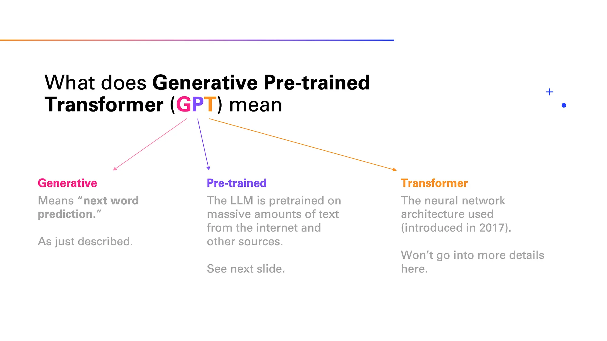

**Transformer** - it’s that the transformer architecture works so well because it can focus its attention on the parts of the input sequence that are most relevant at any time. You could argue that this is similar to how humans work. We, too, need to focus our attention on what’s most relevant to the task and ignore the rest.

Now to the P, which stands for “pre-training”. We discuss next why we suddenly start speaking about pre-training and not just training any longer.

The reason is that Large Language Models like ChatGPT are actually trained in phases.

## Phases of training LLMS

Phases of LLM training: (1) Pre-Training, (2) Instruction Fine-Tuning, (3) Reinforcement from Human Feedback (RLHF).

### Pre-training

This stage requires massive amounts of data to learn to predict the next word. In that phase, the model learns not only to master the grammar and syntax of language, but it also acquires a great deal of knowledge about the world

there might be problem with this - For example, if you ask a pre-trained LLM “What is your fist name?” it may respond with “What is your last name?” simply because this is the kind of data it has seen during pre-training, as in many empty forms, for example. It’s only trying to complete the input sequence.

It doesn’t do well with following instructions simply because this kind of language structure, i.e., instruction followed by a response, is not very commonly seen in the training data. Maybe Quora or StackOverflow would be the closest representation of this sort of structure.

At this stage, we say that the LLM is not aligned with human intentions. Alignment is an important topic for LLMs, and we’ll learn how we can fix this to a large extent, because as it turns out, those pre-trained LLMs are actually quite steerable. So even though initially they don’t respond well to instructions, they can be taught to do so.

### Instruction fine-tuning and RLHF

This is where instruction tuning comes in. We take the pre-trained LLM with its current abilities and do essentially what we did before — i.e., learn to predict one word at a time — but now we do this using only high-quality instruction and response pairs as our training data.

That way, the model un-learns to simply be a text completer and learns to become a helpful assistant that follows instructions and responds in a way that is aligned with the user’s intention. The size of this instruction dataset is typically a lot smaller than the pre-training set. This is because the high-quality instruction-response pairs are much more expensive to create as they are typically sourced from humans. This is very different from the inexpensive self-supervised labels we used in pre-training. This is why this stage is also called  *supervised instruction fine-tuning* .

There is also a third stage that some LLMs like ChatGPT go through, which is  =reinforcement learning from human feedback (RLHF)= .

the purpose is similar to instruction fine-tuning. RLHF also helps alignment and ensures that the LLM’s output reflects human values and preferences. There is some early research that indicates that this stage is critical for reaching or surpassing human-level performance. In fact, combining the fields of reinforcement learning and language modeling is being shown to be especially promising and is likely to lead to some massive improvements over the LLMs we currently have.

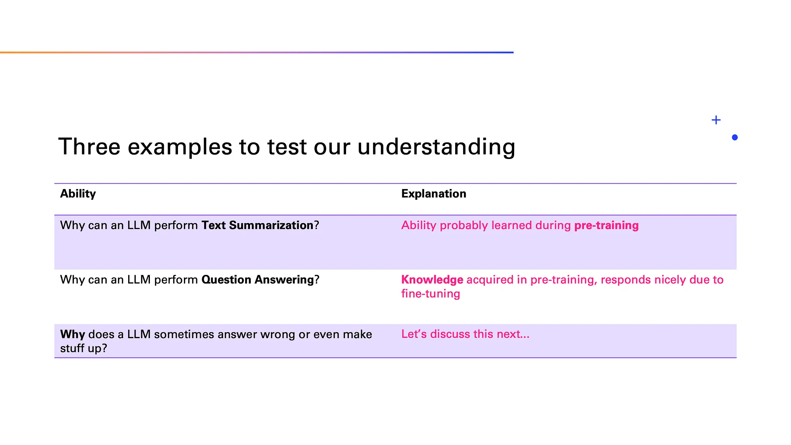

First, **why can an LLM perform summarization** of a longer piece of text?

To understand why, we need to think about the training data. As it so happens, people often make summarizations — on the internet, in research papers, books, and more. As a result, an LLM trained on that data learns how to do that too. It learns to attend to the main points and compress them into a short text.

Note that when a summary is generated, the full text is part of the input sequence of the LLM. This is similar to, say, a research paper that has a conclusion while the full text appears just before.

As a result, that skill has probably been learned during pre-training already, although surely instruction fine-tuning helped improve that skill even further. We can assume that this phase included some summarization examples too.

Second,  **why can a LLM answer common knowledge questions** ?

As mentioned, the ability to act as an assistant and respond appropriately is due to instruction fine-tuning and RLHF. But all (or most of) the knowledge to answer questions itself was already acquired during pre-training.

Of course, that now raises another big question:  **What if the LLM doesn’t know the answer** ? Unfortunately, it may just make one up in that case. To understand why, we need to think about the training data again, and the training objective.

Well, the LLM learns only to generate text, not factually true text. Nothing in its training gives the model any indicator of the truth or reliability of any of the training data. However, that is not even the main issue here, it’s that generally text out there on the internet and in books sounds confident, so the LLM of course learns to sound that way, too, even if it is wrong. In this way, an LLM has little indication of uncertainty.

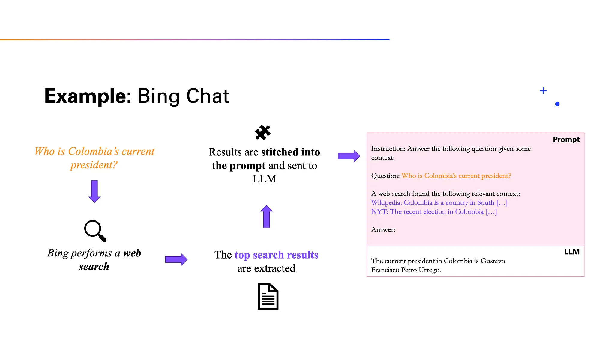

Suppose that you ask the LLM the following question: Who is the current president of Colombia? There’s a good chance an LLM may respond with the wrong name. This could be because of two reasons:

* The first is what we have already brought up: The LLM may just hallucinate and simply respond with a wrong or even fake name.
* The second one I will mention only in passing: LLMs are trained only on data up to a certain cut-off date, and that can be as early as last year. Because of that, the LLM cannot even know the current president with certainty, because things could have changed since the data was created.

So how can we solve both these problems? The answer lies in providing the model some relevant context. The rationale here is that everything that’s in the LLM’s input sequence is readily available for it to process, while any implicit knowledge it has acquired in pre-training is more difficult and precarious for it to retrieve.

This way is better to extract knowledge for current events or factual things and use LLM capabilities of structuring and making inferences out of that data.

# Magic Part

## Zero Shot Prompting

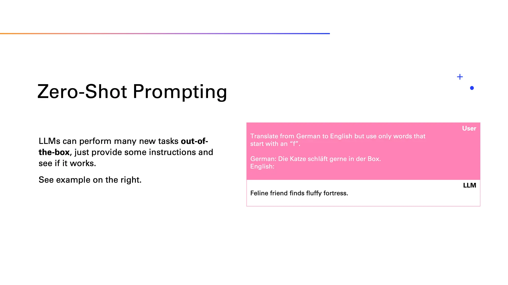

A ubiquitous emerging ability is, just as the name itself suggests, that LLMs can perform entirely new tasks that they haven’t encountered in training, which is called zero-shot. All it takes is some instructions on how to solve the task.

## Few Shot Learning

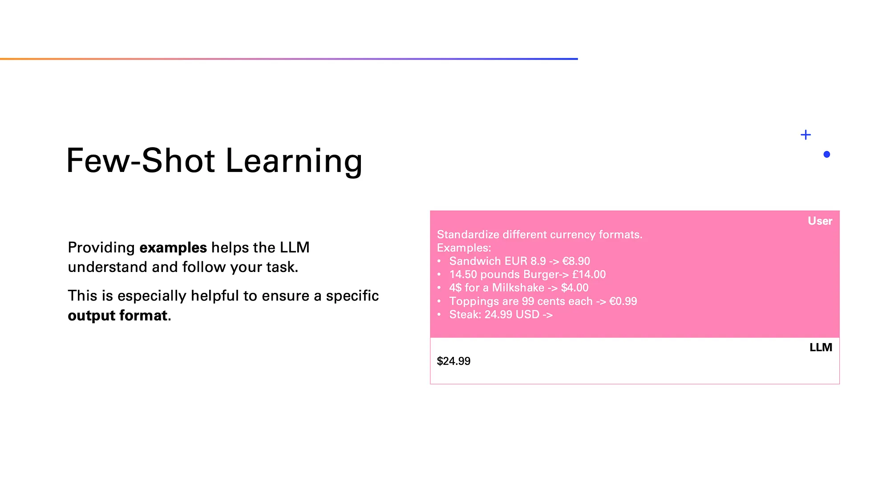

For more complex tasks, you may quickly realize that zero-shot prompting often requires very detailed instructions, and even then, performance is often far from perfect.

To make another connection to human intelligence, if someone tells you to perform a new task, you would probably ask for some examples or demonstrations of how the task is performed. LLMs can benefit from the same.

## Chain of thought prompting

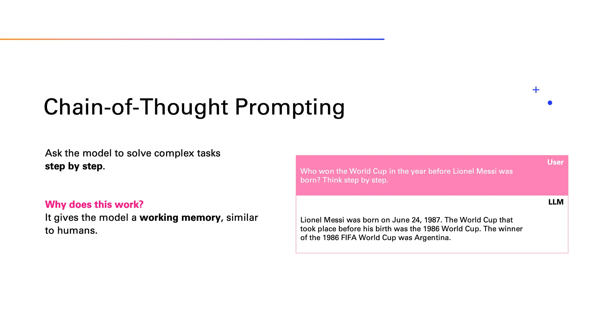

It has been found that simply telling an LLM to “think step by step” can increase its performance substantially in many tasks.

Why does this work? We know everything we need to answer this. The problem is that this kind of unusual composite knowledge is probably not directly in the LLM’s internal memory. However, all the individual facts might be, like Messi’s birthday, and the winners of various World Cups.

Allowing the LLM to build up to the final answer helps because it gives the model time to think out loud — a working memory so to say — and to solve the simpler sub-problems before giving the final answer.

#### Source: [https://medium.com/data-science-at-microsoft/how-large-language-models-work-91c362f5b78f]()
