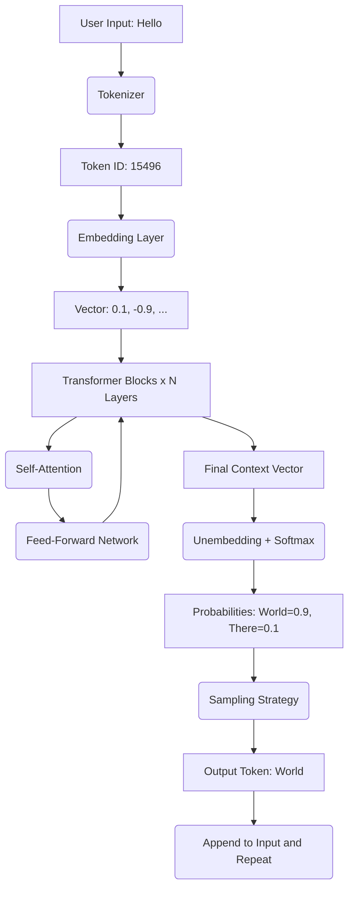

This is the output from NotebookLM based on 3Blue1Brown, and few articles on LLM working by elastic.co, ibm.

---

# Large Language Models (LLMs)

## 1. High-Level Abstract

At its core, an LLM is a **probabilistic function** that maps a sequence of input tokens to a probability distribution over possible next tokens.

Think of it not as a "knowledge base" but as a **lossy compression of the internet**. It does not "know" facts; it predicts the statistical likelihood of the next piece of text based on patterns learned during training.

## 2. The Runtime Architecture (Inference Pipeline)

The following data flow describes a standard "Decoder-only Transformer" (like GPT or Llama).

### Step 1: Pre-processing (Text $\rightarrow$ Numbers)

Neural networks cannot process raw strings. We must convert text into a format compatible with matrix multiplication.

1. **Tokenization:**
   The input string is split into chunks called "Tokens" (parts of words). These are mapped to integers using a static dictionary (Vocabulary).
   * *Analogy:* ASCII encoding, but for word-parts instead of characters.

| Input String | Tokenization (Visual) | Token IDs (Int) |
| :----------- | :-------------------- | :-------------- |
| "The cat"    | `["The", " cat"]`   | ``              |

2. **Vector Embeddings:**
   The system looks up these integers in a massive table (Embedding Matrix). Each integer corresponds to a dense vector (e.g., a list of 12,288 floating-point numbers).

   * *Purpose:* These vectors represent **Semantic Meaning**. In this vector space, "King" - "Man" + "Woman" results in a vector closest to "Queen".
3. **Positional Encoding:**
   Since the Transformer processes all tokens in parallel (unlike a loop), it has no inherent concept of order. We add a "Positional Vector" to the Embeddings so the model knows that "Dog bites Man" is different from "Man bites Dog".

### Step 2: The Transformer Block (The "Hidden State")

The data (now a matrix of vectors) passes through $N$ layers (e.g., 96 layers). Each layer refines the "understanding" of the sequence using **Self-Attention**.

#### A. Self-Attention Mechanism (Context Awareness)

This is the core innovation. It allows tokens to "talk" to each other to resolve ambiguity.

* **The Problem:** In the sentence *"The bank of the river"*, the model needs to know "bank" refers to a river, not money.
* **The Logic:**
  1. Each token projects three vectors: **Query (Q)**, **Key (K)**, and **Value (V)**.
  2. **Query:** "I am 'bank'. I am looking for context."
  3. **Key:** "I am 'river'. I match nature contexts."
  4. **Score:** The model calculates the dot product of Q and K. High score = High relevance.
  5. **Update:** The "Value" of 'river' is added to 'bank', updating 'bank's' vector to reflect a "nature" meaning.

#### B. Feed-Forward Network (Fact Retrieval)

After Attention, the token processes the information individually. This layer acts as a "key-value memory" storing patterns and facts learned during training.

### Step 3: Output Generation (Numbers $\rightarrow$ Text)

After the final layer, we have a context-rich vector for the last token.

1. **Unembedding:** The vector is multiplied against the vocabulary size to produce **Logits** (raw scores) for every possible word in the dictionary.
2. **Softmax:** Logits are normalized into probabilities (0.0 to 1.0).
3. **Sampling (Temperature):** The system selects the next token ID based on these probabilities.
   * **Temperature Parameter:** Controls randomness. Low temp ($0.1$) picks the highest probability (deterministic). High temp ($0.8$) picks lower probability tokens (creative).

**The Auto-Regressive Loop:**
The generated token is appended to the input sequence, and the entire process runs again to generate the *next* token.

---

## 3. System Diagram

---

## 4. Training vs. Inference

It is crucial to distinguish between *building* the model and *running* it.

| Feature                | **Training** (The Build)             | **Inference** (The Run)     |
| :--------------------- | :----------------------------------------- | :-------------------------------- |
| **Goal**         | Calculate optimal weights (Parameters)     | Generate text using fixed weights |
| **Operation**    | Forward Pass +**Backpropagation**    | Forward Pass Only                 |
| **Data Source**  | Trillions of tokens (Web scraping)         | User Prompt                       |
| **Compute Cost** | Massive (Months on thousands of GPUs)      | Low to High (Seconds on 1 GPU)    |
| **Methodology**  | Self-Supervised (Predict next word) + RLHF | Auto-regressive generation        |

### The Training Pipeline

1. **Pre-Training:** The model reads massive datasets to learn grammar, facts, and reasoning by minimizing the error in predicting the next word.
2. **Supervised Fine-Tuning (SFT):** The model is trained on curated Q&A datasets to learn how to be a helpful assistant rather than just a document completer.
3. **RLHF (Reinforcement Learning from Human Feedback):** Humans rank model outputs. A separate Reward Model is trained to predict these rankings, and the LLM is optimized to maximize this reward score.
